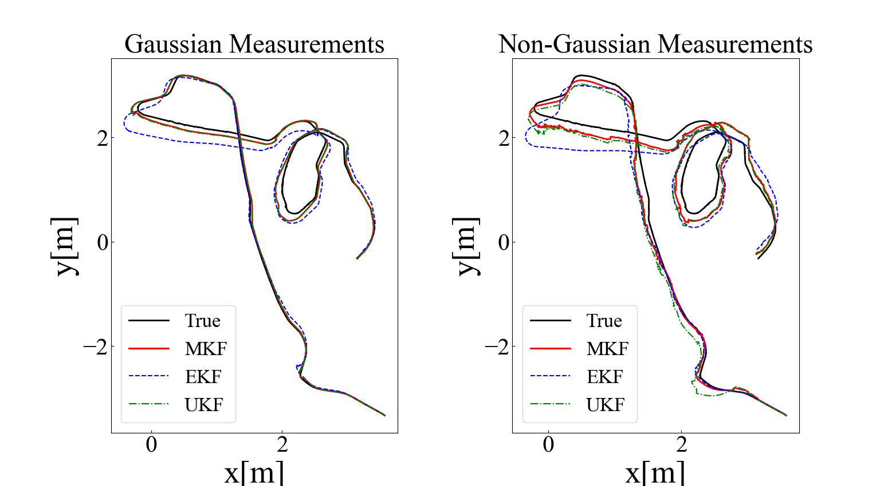
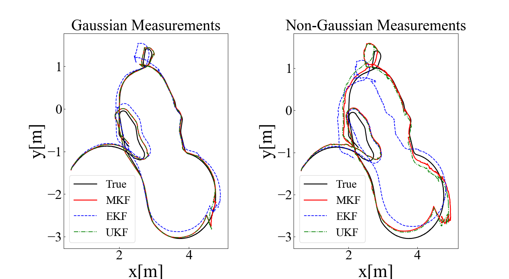

# Moment-based Kalman Filter: Nonlinear Kalman Filtering with Exact Moment Propagation

Moment-based Kalman Filter(MKF) is a nonlinear Kalman filter that uses exact moment propagation method to estimate state from noisy measurements.

## Paper 
coming soon...

## Language and test environment
The main code is written in C++ and visualization code is mainly used Python. However, we also use [matplotlib.cpp](https://github.com/lava/matplotlib-cpp) for the simple visualization in C++. Note that we only test our code on Ubuntu20.04.

## Dataset for the experiment
We use [UTIAS Multi-Robot Cooperative Localization and Mapping Dataset](http://asrl.utias.utoronto.ca/datasets/mrclam/index.html) to evaluate the MKF.

## Requirements
```
CMake >= 3.22
```

## Getting Started
```
git clone https://github.com/purewater0901/MKF.git
cd MKF
mkdir build && cd build
cmake ..
make -j8
```

- Run MKF with Gaussian measurements
```
./main
```

- Run MKF with non-Gaussian measurements  
Before running the code for non-Gaussian environment, you need to preprocess the dataset. After that you can run the main code.
```
./data_preprocessor
./main_non_gaussian
```

## Result with UTIAS dataset
#### Robot1


#### Robot2



## References
<a name="ref1">[1]</a> "Moment-Based Exact Uncertainty Propagation Through Nonlinear Stochastic Autonomous Systems",
S. J. Julier and J. K. Uhlmann,
https://arxiv.org/abs/2101.12490

<a name="ref2">[2]</a> "The UTIAS multi-robot cooperative localization and mapping dataset", 
Leung, Keith and Halpern, Yoni and Barfoot, Timothy and Liu, Hugh,
https://journals.sagepub.com/doi/10.1177/0278364911398404

